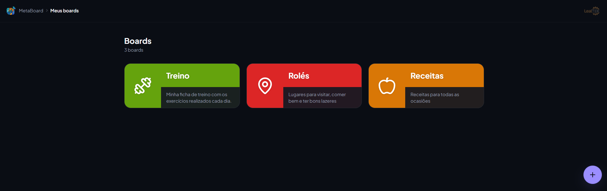
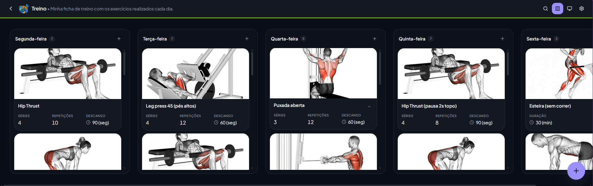
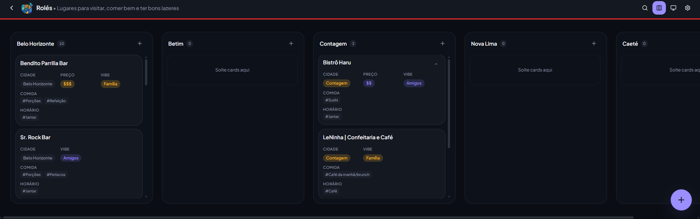
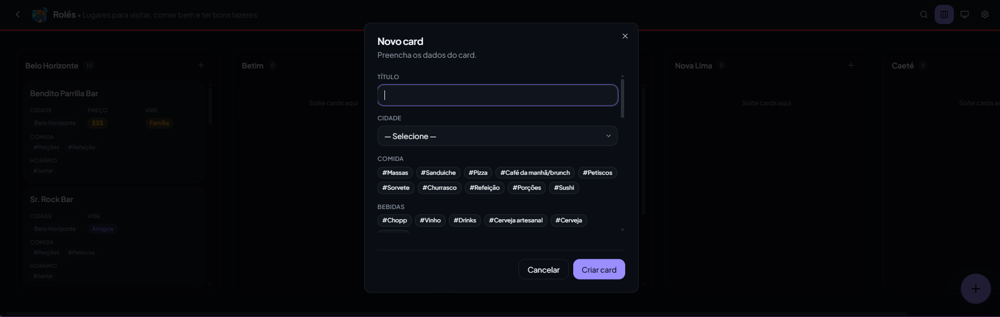
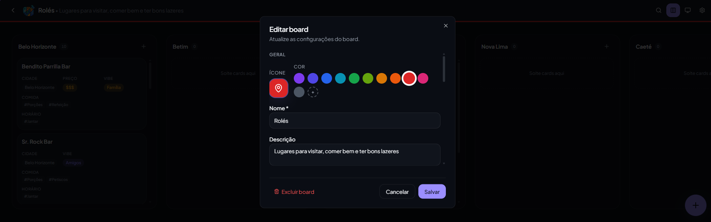
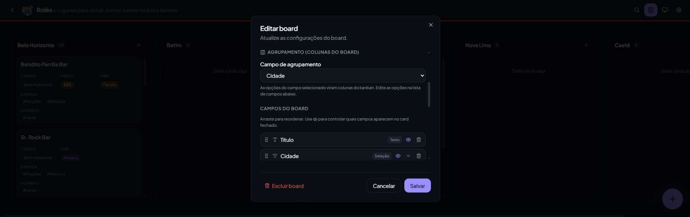
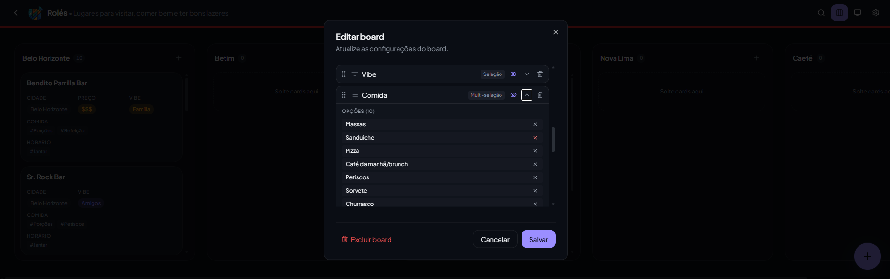

# MetaBoard — Kanban direto na sua planilha Google Sheets

Você usa Google Sheets para organizar tarefas, projetos ou qualquer lista? A planilha resolve o problema de armazenar dados, mas não oferece uma visão de board para acompanhar o fluxo de trabalho.

**MetaBoard resolve isso de forma diferente:** transforma qualquer Google Sheets em um quadro Kanban interativo — sem backend, sem banco de dados próprio, sem mensalidade. Você já tem uma conta Google e uma planilha — isso é suficiente.



<details>
<summary>Ver mais telas</summary>

| Board de treinos                                                          | Board de rolês                                                       |
| ------------------------------------------------------------------------- | -------------------------------------------------------------------- |
|  |  |

| Criar card padrão                                                 | Criar card com IA                                          |
| ----------------------------------------------------------------- | ---------------------------------------------------------- |
|  |  |

| Edição de board — geral                                              | Edição de board — campos                                       | Edição de board — agrupamento                                      |
| -------------------------------------------------------------------- | -------------------------------------------------------------- | ------------------------------------------------------------------ |
|  |  |  |

</details>

---

## Por que usar este sistema

### O problema que ele resolve

Planilhas são ótimas para dados, mas péssimas para visualizar fluxo de trabalho. Você não consegue arrastar uma linha de "Em progresso" para "Concluído", não tem cards visuais com campos customizados e não tem IA para popular dados automaticamente.

Este app foi construído com esse foco:

- **Boards múltiplos por planilha** — cada aba de configuração vira um board independente; organize projetos, treinos, tarefas ou qualquer coisa na mesma planilha
- **Kanban nativo com drag & drop** — arraste cards entre colunas, reordene dentro da coluna, tudo sincronizando de volta na planilha em tempo real
- **17 tipos de campo** — texto, número, data, URL, imagem, checklist, seleção, multi-seleção, chip, email, cor, localização, duração e mais
- **IA integrada** — cole qualquer texto (e-mail, anotação, conversa) e a IA extrai os campos do card automaticamente; revise, aprove ou rejeite cada extração antes de criar
- **Responsivo por design** — desktop exibe todas as colunas em scroll horizontal; mobile usa tabs por coluna com drag & drop adaptado para touch

### Por que Google Sheets

- **Sem servidor próprio** — zero custo de infraestrutura, zero configuração de banco de dados
- **Você controla os dados** — a planilha é sua, no seu Google Drive, exportável a qualquer momento
- **Auditável** — abra a planilha e veja, edite ou corrija qualquer dado diretamente
- **Backup automático** — o Google já faz isso por você
- **Colaboração nativa** — compartilhe a planilha com quem quiser; o board reflete as permissões do Sheets

### O que você ganha de UI que uma planilha não te dá

- Visualização Kanban com colunas dinâmicas baseadas em qualquer campo de seleção
- Criação de cards com IA — extraia campos de texto livre com um clique
- Drag & drop para reordenar e mover cards entre colunas
- Cards com layout configurável: escolha quais campos aparecem no card fechado
- Drawer lateral para visualização e edição completa do card aberto
- Busca textual e filtro por tags diretamente no board

---

## Funcionalidades

### Seleção de Planilha

Após o primeiro login (ou ao clicar em "Trocar planilha"), o app exibe a tela `/setup`:

- **Listar planilhas** — busca as planilhas do Google Drive do usuário via Drive API v3
- **Busca local** — filtra a lista por nome em tempo real
- **Criar nova planilha** — cria uma planilha em branco e a organiza automaticamente dentro da pasta **"LealTEK Apps"** no Drive
- A escolha fica salva em `localStorage`, associada ao e-mail do usuário, e é restaurada automaticamente em sessões futuras

**Menu do usuário** (`UserAccountMenu`) — acessível pelo avatar no canto superior direito em todas as telas autenticadas:

- Exibe nome e e-mail da conta Google
- Atalho para **Trocar planilha** (redireciona para `/setup`)
- Botão de **Sair** (encerra a sessão)

**Sincronização cross-tab** — ao sair em uma aba, todas as outras abas abertas deslogam automaticamente. Um `silentSignIn()` com `prompt: none` recupera o token de acesso em novas abas sem exigir nova interação do usuário.

### Lista de Boards

A tela inicial (após login) exibe todos os boards configurados na planilha conectada:

- Grid responsivo com card visual por board: ícone, cor customizada, nome e descrição
- Botão FAB para criar um novo board
- Hover revela botão de configurações de cada board (⚙)
- Skeleton loading durante carregamento


### Board Kanban

O coração do app: visualização das colunas e cards.

- **Colunas dinâmicas** — geradas a partir das opções do campo de agrupamento configurado (ex.: "Status" com opções "A fazer", "Em progresso", "Concluído")
- **Drag & drop** — mova cards entre colunas ou reordene dentro da mesma coluna (dnd-kit com suporte a pointer e touch)
- **Card fechado** — exibe os campos configurados no `cardClosedLayout`; clique para abrir o drawer completo
- **Busca** — filtra cards em tempo real por campos marcados como `searchable`
- **Filtro por tags** — filtra por valores de campos chip/multiselect
- **Modo lista** — quando nenhum campo de agrupamento está configurado, exibe todos os cards em lista plana

| Board de treinos                                     | Board de rolês                                    |
| ---------------------------------------------------- | ------------------------------------------------- |
|  |  |

**Mobile:** tabs horizontais rolizáveis por coluna substituem o scroll horizontal; drag & drop adaptado para touch com delay de 250ms.

### Criar Card

Dois modos de criação acessíveis via Speed Dial (FAB no canto inferior direito):

**Criação padrão**

- Modal com todos os campos editáveis do board
- Validação por campo obrigatório
- Card criado na coluna selecionada (ou na primeira disponível)


**Criação com IA**

- Cole qualquer texto (e-mail, nota, conversa, briefing)
- A IA extrai os campos do card automaticamente e indica a fonte de cada valor: `extraído` (do texto) ou `buscado` (inferido)
- Interface de revisão em card-stack: navegue entre os cards extraídos, aprove ✓ ou rejeite ✗ cada um
- Indicadores visuais: verde para aprovado, vermelho para rejeitado, cinza para pendente
- Tooltips explicam o raciocínio da IA para cada campo preenchido
- Botão "Criar (N)" cria apenas os cards aprovados


### Drawer de Card

Ao clicar em um card, um drawer lateral abre com todos os campos do board:

- Visualização e edição inline de todos os campos (`cardOpenLayout`)
- Cada tipo de campo renderiza seu editor especializado (date picker, color picker, checklist interativo, etc.)
- Salvamento automático ao sair do campo
- Botão de exclusão do card

### Configuração de Board

Modal de edição completa acessível pelo botão ⚙ de cada board:

- **Nome, descrição, ícone e cor** — ícone escolhido de uma biblioteca Lucide; cor via color picker com preview do card
- **Campo de agrupamento** — selecione qual campo de seleção/chip/multi-seleção vira as colunas do kanban
- **Campos do board** — lista com drag & drop para reordenar; toggle por campo para aparecer no card fechado (Eye/EyeOff); edição inline das opções de campos select/chip; botão para adicionar novos campos com tipo
- **Exclusão** — com confirmação de segurança

| Geral                                                       | Campos                                                         | Agrupamento                                                        |
| ----------------------------------------------------------- | -------------------------------------------------------------- | ------------------------------------------------------------------ |
|  |  |  |

### Tipos de Campo

| Tipo          | Label         | Descrição                          |
| ------------- | ------------- | ---------------------------------- |
| `text`        | Texto         | Texto curto de linha única         |
| `longtext`    | Texto longo   | Parágrafo com quebras de linha     |
| `number`      | Número        | Valor numérico                     |
| `bool`        | Booleano      | Checkbox sim/não                   |
| `date`        | Data          | Seletor de data (YYYY-MM-DD)       |
| `datetime`    | Data e hora   | Data com horário                   |
| `url`         | URL           | Link clicável                      |
| `image`       | Imagem        | URL de imagem com preview          |
| `icon`        | Ícone         | Ícone Lucide selecionável          |
| `chip`        | Chip          | Badge colorido de seleção única    |
| `select`      | Seleção       | Dropdown de opção única            |
| `multiselect` | Multi-seleção | Múltiplas opções selecionáveis     |
| `checklist`   | Checklist     | Lista de itens com checkbox        |
| `email`       | E-mail        | Endereço de e-mail                 |
| `color`       | Cor           | Seletor de cor hex                 |
| `location`    | Localização   | Texto de endereço/local            |
| `duration`    | Duração       | Valor com unidade (seg/min/hr/dia) |

### UX transversal

- Tema claro/escuro persistido
- Animações com Framer Motion em cards, modais e transições de rota
- Skeleton loading em grids e colunas
- Toast notifications para todas as ações
- Rota `*` com página 404 customizada
- **Sincronização cross-tab** — logout em uma aba encerra todas; `silentSignIn` restaura token sem interação
- **AuthSplash** — spinner exibido durante a inicialização da sessão antes de renderizar rotas protegidas

## Rotas da aplicação

| Rota               | Página                                                            |
| ------------------ | ----------------------------------------------------------------- |
| `/`                | Login com Google OAuth                                            |
| `/setup`           | Seleção ou criação de planilha (exibida após login sem planilha) |
| `/boards`          | Lista de boards da planilha conectada                             |
| `/boards/:boardId` | Kanban board específico                                           |
| `*`                | Página não encontrada                                             |

---

## Stack

- **React 19** + TypeScript + Vite 8
- **Tailwind v4** + shadcn/ui (Radix-based)
- **React Router v7** (SPA)
- **TanStack Query v5**
- **dnd-kit** (drag & drop — @dnd-kit/core + @dnd-kit/sortable)
- **Framer Motion** (animações)
- **React Hook Form** + Zod (formulários e validação)
- **Zustand** (estado global: board + auth + spreadsheet)
- **Google Identity Services** (OAuth implícito, token em memória)
- **Google Drive API v3** (listagem e criação de planilhas)
- **OpenAI API** via **Vercel Edge Functions** (extração de campos com IA — chave nunca exposta no bundle)

---

## Arquitetura

```
routes → modules → shared/providers ← shared/auth
                         ↑
              ISheetProvider (contrato)
                         ↑
              GoogleSheetProvider (implementação)
```

**Regra de dependência:** páginas e módulos dependem da interface `ISheetProvider`. Nunca importam diretamente de `GoogleSheetProvider`.

`providerFactory.ts` é o único ponto de instanciação em runtime: cria `GoogleSheetProvider` com o `spreadsheetId` e `GoogleAuthService` configurados via variáveis de ambiente.

### Estrutura de pastas

```
api/
  openai/
    chat.ts                 Vercel Edge Function — proxy para /v1/chat/completions
    responses.ts            Vercel Edge Function — proxy para /v1/responses
src/
  modules/
    board/
      ui/                   KanbanBoard, CardItem, CardDrawer, AiCardModal, CreateCardModal, EditBoardModal, BoardTopBar, CreateCardSpeedDial
      store.ts              Zustand: board ativo, fields, cards, busca, filtros
      useBoardData.ts       TanStack Query — carrega board, fields e cards
      useCardMutations.ts   Mutações: criar, salvar, deletar card e reordenar
      useAiCardExtraction.ts Hook de extração de campos com IA (OpenAI via proxy)
    project/
      domain/types.ts       Tipos: BoardConfig, FieldDef, CardRecord, FieldType, FieldValue...
      ui/CreateBoardModal.tsx Modal de criação de novo board
    fields/
      FieldRenderer.tsx     Renderizador de campos em modo closed/open
  components/
    UserAccountMenu.tsx     Menu do usuário: avatar, nome/email, trocar planilha, sair
  routes/
    HomePage.tsx            Página de login
    SpreadsheetSetupPage.tsx Seleção ou criação de planilha (pós-login, sem planilha salva)
    SpreadsheetPage.tsx     Lista de boards
    BoardPage.tsx           Board Kanban
  shared/
    providers/
      ISheetProvider.ts     Interface — contrato único de acesso a dados
      GoogleSheetProvider.ts CRUD via Sheets API v4
      providerFactory.ts    initProvider(id) — instancia provider sob demanda
    auth/
      GoogleAuthService.ts  OAuth2 implícito; silentSignIn para refresh cross-tab
    api/
      SheetsApiClient.ts    HTTP client para Sheets API v4
      DriveApiClient.ts     Listagem e criação de planilhas via Drive API v3
      OpenAiClient.ts       Client OpenAI — chama proxy Vercel, nunca OpenAI diretamente
    cache/
      localCache.ts         Cache local com IndexedDB (idb)
    icons/
      iconRegistry.ts       Mapeamento icon_id → componente Lucide
      BoardIconPicker.tsx   Seletor de ícone
    colors/
      BoardColorPicker.tsx  Seletor de cor
  store/
    authStore.ts            Zustand: usuário autenticado + isInitializing
    spreadsheetStore.ts     Zustand + localStorage: spreadsheetId salvo por e-mail
  settings/
    themeStore.ts           Zustand: tema claro/escuro
  app/
    App.tsx                 Router raiz + rotas protegidas + useAuthSync (cross-tab)
    providers.tsx           TanStack Query + Sonner
```

### Arquivos-chave

| Arquivo                                       | Papel                                                                    |
| --------------------------------------------- | ------------------------------------------------------------------------ |
| `src/modules/project/domain/types.ts`         | Todos os tipos: BoardConfig, FieldDef, CardRecord, FieldType, FieldValue |
| `src/shared/providers/ISheetProvider.ts`      | Interface `ISheetProvider` — contrato único                              |
| `src/shared/providers/GoogleSheetProvider.ts` | CRUD contra a Sheets API v4                                              |
| `src/shared/providers/providerFactory.ts`     | `initProvider(id)` — instancia provider sob demanda (não mais singleton) |
| `src/shared/auth/GoogleAuthService.ts`        | OAuth implícito Google; `silentSignIn()` para refresh cross-tab          |
| `src/shared/api/DriveApiClient.ts`            | Lista planilhas do Drive e cria novas dentro da pasta "LealTEK Apps"     |
| `src/store/authStore.ts`                      | Zustand: usuário autenticado + flag `isInitializing`                     |
| `src/store/spreadsheetStore.ts`               | Zustand + localStorage: `spreadsheetId` persistido por e-mail            |
| `src/routes/SpreadsheetSetupPage.tsx`         | Fluxo de seleção/criação de planilha após primeiro login                 |
| `src/components/UserAccountMenu.tsx`          | Menu do usuário: avatar, nome/email, trocar planilha, sair               |
| `src/modules/board/store.ts`                  | Zustand: board ativo, fields, cards, busca e filtros                     |
| `src/modules/board/useBoardData.ts`           | TanStack Query — carrega e sincroniza dados do board                     |
| `src/modules/board/useCardMutations.ts`       | Mutações de card com reordenação otimista                                |
| `src/modules/board/useAiCardExtraction.ts`    | Extração de campos via OpenAI (chama proxy Vercel, não OpenAI diretamente)|
| `api/openai/chat.ts`                          | Vercel Edge Function — proxy seguro para OpenAI `/v1/chat/completions`   |
| `api/openai/responses.ts`                     | Vercel Edge Function — proxy seguro para OpenAI `/v1/responses`          |

### Entidades e convenções de dados

| Entidade        | Campos principais                                                                                                                               |
| --------------- | ----------------------------------------------------------------------------------------------------------------------------------------------- |
| **BoardConfig** | `id`, `name`, `icon`, `color?`, `description?`, `groupBy`, `orderBy`, `cardTitleField`, `cardClosedLayout`, `cardOpenLayout`, `archivedColumn?` |
| **FieldDef**    | `id`, `boardId`, `label`, `type`, `required?`, `options?`, `visible?`, `editable?`, `searchable?`, `sortable?`, `displayOrder?`                 |
| **CardRecord**  | `_id`, `boardId`, `_sort`, `_archived`, `_createdAt`, `_updatedAt` + campos dinâmicos por board                                                 |

**Regras de negócio:**

- Campos dinâmicos do card são determinados em runtime pelos `FieldDef` do board
- `groupBy` referencia o `id` de um `FieldDef` do tipo select/chip/multiselect; suas `options` viram as colunas
- `cardClosedLayout` é um array de `field.id` que define quais campos aparecem no card fechado
- `_sort` é um número inteiro usado para ordenação dentro da coluna; o reorder persiste todos os cards afetados
- Cards arquivados (`_archived: true`) são filtrados do board mas não deletados da planilha

---

## Rodando localmente

> **Atenção:** este app **não tem modo mock**. As variáveis de ambiente são obrigatórias. Sem elas, o dev server sobe mas a aplicação lança erro ao inicializar.

```bash
npm install
npm run dev        # http://localhost:5173
```

### Scripts disponíveis

```bash
npm run dev        # Dev server
npm run build      # Build de produção (output: dist/)
npm run preview    # Preview do build local
npm run lint       # ESLint
npm run format     # Prettier
```

---

## Conectando ao Google Sheets

### Passo 1 — Preparar a planilha

Crie uma planilha no Google Drive. O MetaBoard usa uma estrutura de abas dinâmica que é **criada automaticamente** pela funcionalidade `initializeSpreadsheet()` na primeira conexão.

Copie o `spreadsheetId` da URL:

```
https://docs.google.com/spreadsheets/d/<SPREADSHEET_ID>/edit
```

### Passo 2 — Criar projeto no Google Cloud Console

1. Acesse https://console.cloud.google.com → crie um projeto
2. Em **APIs & Services → Library**, pesquise e habilite **Google Sheets API** e **Google Drive API**
3. Em **APIs & Services → OAuth consent screen**:
   - Tipo: **External**
   - Preencha nome do app, e-mail de suporte e e-mail do desenvolvedor
   - Em **Scopes**, adicione: `spreadsheets` (Sheets API) e `drive.file` (Drive API — acessa apenas arquivos criados/abertos pelo app)
   - Em **Test users**, adicione seu e-mail (obrigatório enquanto o app estiver em modo de teste)
   - Salvar e continuar

### Passo 3 — Criar credencial OAuth Client ID

1. **Credentials → Create credentials → OAuth Client ID**
2. Tipo: **Web application**
3. Nome: ex. `MetaBoard Web`
4. **Authorized JavaScript origins** — adicione:
   ```
   http://localhost:5173
   https://seudominio.com
   ```
5. Criar → copie o **Client ID** (formato: `xxxxx.apps.googleusercontent.com`)

> URIs de redirecionamento não são necessários para o fluxo implícito.

### Passo 4 — Configurar variáveis de ambiente

Crie `.env.local` na raiz do projeto:

```env
VITE_GOOGLE_CLIENT_ID=xxxxx.apps.googleusercontent.com
OPENAI_API_KEY=sk-...               # Opcional — habilita criação de cards com IA (server-side)
```

> `VITE_SPREADSHEET_ID` foi removido — cada usuário seleciona ou cria sua própria planilha no primeiro login.
> `OPENAI_API_KEY` **não usa o prefixo `VITE_`** — ela vive apenas nas Vercel Edge Functions e nunca é injetada no bundle do browser.

Reinicie o dev server.

### Passo 5 — Autenticar no app

Na tela inicial, clique **Continuar com Google** — uma popup abre pedindo consentimento. O token de acesso fica **somente em memória** (closure em `src/shared/auth/GoogleAuthService.ts`). Nunca é gravado em `localStorage` ou cookies.

Após o login, se nenhuma planilha estiver configurada, o app redireciona automaticamente para `/setup`, onde o usuário pode:

- **Selecionar** uma planilha existente do Google Drive
- **Criar** uma nova planilha (salva automaticamente dentro da pasta **"LealTEK Apps"** no Drive)

A escolha fica salva em `localStorage` associada ao e-mail do usuário. É possível trocar de planilha a qualquer momento pelo **menu do usuário** (avatar no canto superior direito).

### Segurança — o que NÃO fazemos

- Não armazenamos `client_secret`, service account ou private keys
- Não persistimos o `access_token` entre sessões — ele vive apenas em closure; `silentSignIn()` recupera um novo token sem interação do usuário em novas abas
- `spreadsheetId` é salvo em `localStorage` associado ao e-mail do usuário — o usuário controla qual planilha usar
- `OPENAI_API_KEY` nunca chega ao browser — todas as chamadas à OpenAI passam pelas Vercel Edge Functions em `api/openai/`

---

## Deploy

### Digital Ocean App Platform

**Passo 1 — Criar o app**

1. Acesse https://cloud.digitalocean.com/apps → **Create App**
2. Conecte ao GitHub e selecione o repositório
3. Configure o componente:
   - **Type:** Static Site
   - **Build command:** `npm run build`
   - **Output directory:** `dist`
   - **Plan:** Starter ($0)

**Passo 2 — Configurar variáveis de ambiente**

Em **Settings → Environment Variables**, adicione:

| Variável                | Valor                              | Visibilidade    |
| ----------------------- | ---------------------------------- | --------------- |
| `VITE_GOOGLE_CLIENT_ID` | `xxxxx.apps.googleusercontent.com` | Build (VITE_)   |
| `OPENAI_API_KEY`        | `sk-...` (opcional)                | Server (seguro) |

> `VITE_SPREADSHEET_ID` foi removido — cada usuário conecta sua própria planilha pelo app.
> `OPENAI_API_KEY` **não usa o prefixo `VITE_`** — ela só é acessível pelas Edge Functions e nunca aparece no bundle público.

**Passo 3 — Configurar roteamento SPA**

Para que o React Router funcione em rotas internas (ex: `/boards/abc123`), configure o documento de fallback:

1. Em **Settings → App Spec**, edite o YAML e adicione `catchall_document`:
   ```yaml
   static_sites:
     - name: meta-board
       catchall_document: index.html
   ```
2. Ou via UI: **Settings → Components → seu site → Error Document** → informe `index.html`

**Passo 4 — Deploy**

O Digital Ocean faz deploy automático a cada push na branch `main`. A URL temporária ficará disponível em:

```
https://meta-board-XXXXX.ondigitalocean.app
```

---

## Domínio personalizado (Cloudflare + Digital Ocean)

### Passo 1 — Adicionar domínio no Digital Ocean

1. Acesse o app → **Settings → Domains → Add Domain**
2. Digite o domínio (ex: `board.meusite.com`) → **Add**
3. O Digital Ocean mostrará o registro DNS necessário (CNAME)

### Passo 2 — Configurar DNS no Cloudflare

1. Acesse https://dash.cloudflare.com → selecione o domínio
2. Vá em **DNS → Add Record**:

```
Type:    CNAME
Name:    board          (ou @ para domínio raiz)
Target:  meta-board-XXXXX.ondigitalocean.app
Proxy:   ON (laranja)
TTL:     Auto
```

> Com proxy Cloudflare ativado, o SSL é gerenciado automaticamente.

### Passo 3 — Atualizar origens autorizadas no Google Cloud Console

Em **Credentials → seu OAuth Client ID → Authorized JavaScript origins**, adicione:

```
https://board.meusite.com
```

Sem isso, o login com Google será bloqueado no domínio personalizado.

### Passo 4 — Verificar

Aguarde a propagação DNS (geralmente < 5 min com Cloudflare) e acesse o domínio. HTTPS estará ativo automaticamente.

---

## Adicionando novos providers

Para migrar para um backend próprio (Express, Hono, Supabase, etc.) ou adicionar outro source de dados:

1. Crie `src/shared/providers/MyProvider.ts` implementando `ISheetProvider` (`src/shared/providers/ISheetProvider.ts`)
2. Edite `src/shared/providers/providerFactory.ts` para retornar a nova implementação
3. UI, módulos e hooks **não precisam mudar** — dependem do contrato, não da implementação
